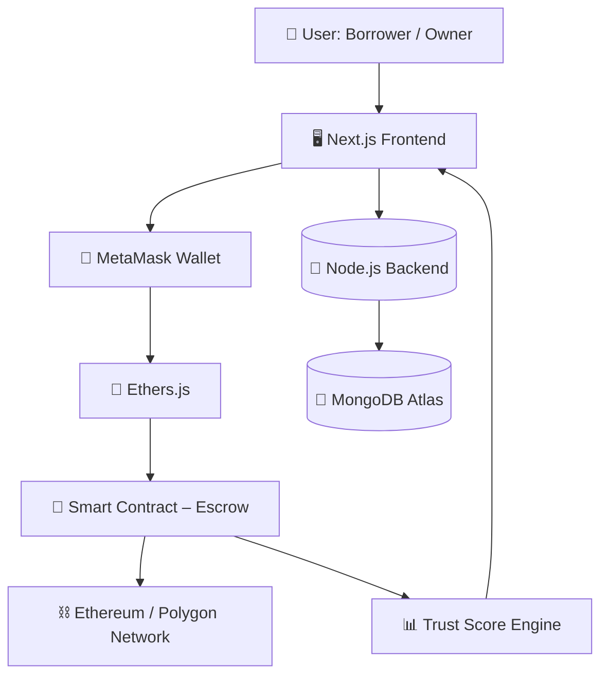

<div align="center">

# 🔐 VeriFlow  
### *Decentralized Collateral-Based Resource Lending Protocol*  

🚀 A Web3-powered platform for **trustless peer-to-peer rentals**, leveraging **blockchain-secured collateral, smart contract escrow, and dynamic trust scoring**.  


</div>

---

## 📖 Overview  

**VeriFlow** is a decentralized platform that enables users to **borrow and lend real-world assets securely** without relying on trust.  

By integrating **smart contract escrow**, **on-chain reputation**, and **dynamic collateral mechanisms**, it ensures **fraud-proof, transparent, and instant rental transactions**—eliminating inefficiencies of traditional rental platforms.

---

## 🏗️ System Architecture  



---

## 💎 MVP Features  

VeriFlow delivers a **trustless rental ecosystem** by combining Web3 authentication, smart contract escrow, and dynamic risk-based collateral into a seamless user experience.

- 🔐 **Wallet-Based Authentication** → Secure, passwordless login via MetaMask  
- 📦 **End-to-End Rental Flow** → List, discover, borrow, and return real-world assets effortlessly  
- 🔐 **Smart Contract Escrow** → Collateral is locked, managed, and released automatically on-chain  
- ⚡ **Instant Settlement** → Funds are released immediately upon successful return—no intermediaries  
- 📊 **Dynamic Collateral Engine** → Deposit requirements adapt based on user trust score  
- 🪪 **On-chain Reputation System** → Builds verifiable credibility across transactions  
- 📈 **Owner Dashboard** → Manage listings, monitor rentals, and track asset status in real-time  
- 📜 **Immutable Transaction History** → Transparent and tamper-proof records on blockchain  
- 🛡️ **Trustless Security Model** → Eliminates fraud and bias through automated smart contract execution

---

## 👥 Team & Collaborators  

<!---| Name | Role | Contribution |
|------|------|--------------|
| 👨‍🔬 Aryan Ghosh | ML Engineer | Model Training & Flask API |
| 👩‍💻 Collaborator 2 | IoT Dev | ESP32 Sensor Integration |
| 👨‍💻 Collaborator 3 | Frontend Dev | Next.js Dashboard |
| 👩‍🔬 Collaborator 4 | Data Scientist | API + Visualization |--->

* 👨‍🔬[Aryan Ghosh](https://github.com/Aryan-Ghosh-Code)
* 👨‍🔬[Spandan Chakraborty](https://github.com/Spandan-Chakraborty)
* 👨‍🔬[Souhardya Ray](https://github.com/Souhardya-Ray)
* 👨‍🔬[Priyunshu Saha](https://github.com/PRIYUNSHU21)

---

## 🚀 Getting Started  

### 🔹 Server: Setup Backend & Smart Contracts
```bash
cd server
npm install
Terminal 1: npx hardhat node
Terminal 2: npx hardhat run scripts/deploy.js --network localhost
Terminal 3: npm run dev
```

### 🔹 Client (Next.js)  
```bash
cd frontend
npm install
npm run dev
```

### 🔹 Environment Variables (🔑.env.local)  
```bash
NEXT_PUBLIC_RPC_URL=your_rpc_url
NEXT_PUBLIC_CONTRACT_ADDRESS=your_contract_address
MONGODB_URI=your_mongodb_uri
PRIVATE_KEY=your_wallet_private_key
RPC_URL=your_rpc_url
```

---

## 🗺️ Roadmap  

- [x] Smart Contract Escrow  
- [x] Resource Listing System
- [x] Wallet Authentication 
- [x] Dynamic Collateral  
- [ ] DAO Dispute Resolution  
- [ ] Multichain Support

---

## 📜 License  

Apache-2.0 license © 2026 **VeriFlow Team**  

---

<div align="center">

⭐ If you find this project useful, consider giving it a **star** on GitHub to support us!  

🔐 Building a future of **trustless, secure, and decentralized rentals** 🌐  

**✨ VeriFlow – Where trust is enforced by code, not promises. 🚀**

</div>
